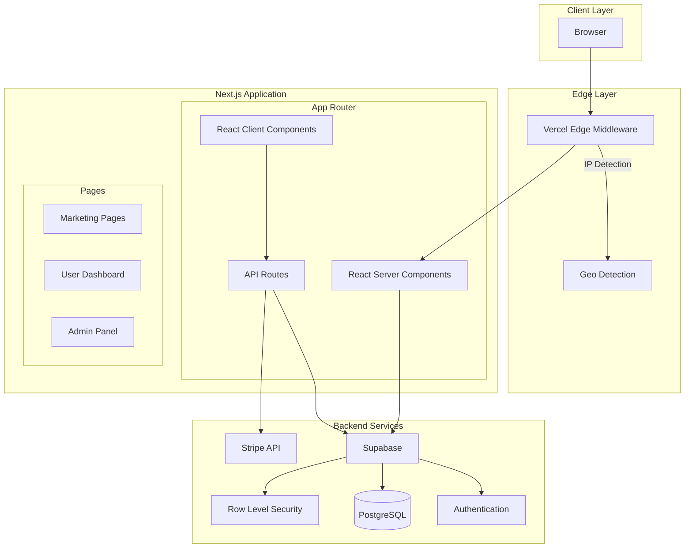
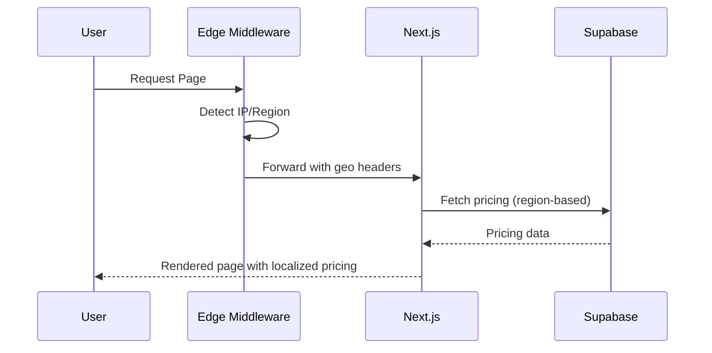

# Design Document: Layerium Cloud

## Overview

Layerium Cloud is a production-grade SaaS platform for VPS and RDP server hosting built with Next.js 15 (App Router), React 19, TypeScript, Supabase, and Tailwind CSS v4. The architecture follows a modern full-stack approach with server components, server actions, edge middleware for geo-detection, and a comprehensive design system that delivers enterprise-level polish comparable to DigitalOcean, Vultr, and Stripe.

**Tech Stack:**
- **Next.js 15** - App Router with React Server Components and Server Actions
- **React 19** - Latest stable with use() hook, Server Components, and improved Suspense
- **TypeScript 5.x** - Full type safety
- **Tailwind CSS v4** - CSS-first configuration with @theme directive
- **Supabase** - Authentication, PostgreSQL database, Row Level Security
- **Framer Motion** - Subtle, premium animations
- **Zod** - Runtime validation
- **Vitest + fast-check** - Unit and property-based testing

The platform consists of three main areas:
1. **Public Marketing Website** - Landing pages with IP-based dynamic pricing
2. **User Dashboard** - Authenticated area for server and billing management
3. **Admin Panel** - Administrative interface for platform operations

## Architecture



### Request Flow



## Components and Interfaces

### Project Structure

```
layerium-cloud/
├── app/
│   ├── (marketing)/           # Public marketing pages
│   │   ├── page.tsx           # Home/Landing
│   │   ├── pricing/
│   │   ├── features/
│   │   └── layout.tsx
│   ├── (auth)/                # Authentication pages
│   │   ├── login/
│   │   ├── register/
│   │   └── layout.tsx
│   ├── (dashboard)/           # User dashboard
│   │   ├── dashboard/
│   │   ├── servers/
│   │   ├── billing/
│   │   ├── support/
│   │   └── layout.tsx
│   ├── (admin)/               # Admin panel
│   │   ├── admin/
│   │   └── layout.tsx
│   ├── api/                   # API routes
│   │   ├── auth/
│   │   ├── servers/
│   │   ├── pricing/
│   │   └── tickets/
│   ├── layout.tsx             # Root layout
│   └── globals.css
├── components/
│   ├── ui/                    # Design system components
│   │   ├── button.tsx
│   │   ├── card.tsx
│   │   ├── input.tsx
│   │   ├── accordion.tsx
│   │   └── ...
│   ├── marketing/             # Marketing page components
│   │   ├── hero.tsx
│   │   ├── features.tsx
│   │   ├── pricing-table.tsx
│   │   ├── testimonials.tsx
│   │   ├── faq.tsx
│   │   └── footer.tsx
│   ├── dashboard/             # Dashboard components
│   │   ├── server-card.tsx
│   │   ├── stats-widget.tsx
│   │   ├── billing-table.tsx
│   │   └── ...
│   └── admin/                 # Admin components
│       ├── data-table.tsx
│       ├── user-management.tsx
│       └── ...
├── lib/
│   ├── supabase/
│   │   ├── client.ts          # Browser client
│   │   ├── server.ts          # Server client
│   │   └── admin.ts           # Admin client
│   ├── stripe/
│   │   └── client.ts
│   ├── utils/
│   │   ├── pricing.ts
│   │   └── geo.ts
│   └── validations/           # Zod schemas
│       ├── auth.ts
│       ├── server.ts
│       └── ticket.ts
├── hooks/                     # Custom React hooks
│   ├── use-pricing.ts
│   ├── use-servers.ts
│   └── use-auth.ts
├── types/                     # TypeScript types
│   ├── database.ts
│   ├── api.ts
│   └── pricing.ts
├── middleware.ts              # Edge middleware
└── next.config.ts             # Next.js 15 config (TypeScript)
```

### Tailwind CSS v4 Configuration

Tailwind CSS v4 uses CSS-first configuration with the `@theme` directive instead of `tailwind.config.ts`:

```css
/* app/globals.css */
@import "tailwindcss";

@theme {
  /* Color Palette - Layerium Cloud Design System */
  --color-primary: #cafc4f;
  --color-background: #ffe4db;
  --color-surface-1: #fcf7f3;
  --color-surface-2: #f0ede8;
  --color-dark: #1e1f26;
  
  /* Font Families */
  --font-google-sans: "Google Sans", system-ui, sans-serif;
  --font-dm-sans: "DM Sans", system-ui, sans-serif;
  --font-outfit: "Outfit", system-ui, sans-serif;
  --font-work-sans: "Work Sans", system-ui, sans-serif;
  
  /* Shadows - Soft, premium feel */
  --shadow-soft: 0 2px 8px rgba(30, 31, 38, 0.06);
  --shadow-card: 0 4px 16px rgba(30, 31, 38, 0.08);
  
  /* Border Radius - Pill shapes */
  --radius-pill: 9999px;
  --radius-card: 16px;
  --radius-input: 12px;
}

/* Base styles */
@layer base {
  body {
    @apply bg-background text-dark font-outfit;
  }
  
  h1, h2, h3, h4, h5, h6 {
    @apply font-google-sans font-semibold;
  }
}
```

### Core Interfaces

```typescript
// types/database.ts

export type UserRole = 'USER' | 'ADMIN';

export interface User {
  id: string;
  email: string;
  full_name: string;
  avatar_url?: string;
  role: UserRole;
  created_at: string;
  updated_at: string;
}

export interface PricingPlan {
  id: string;
  name: string;
  type: 'VPS' | 'RDP';
  cpu_cores: number;
  ram_gb: number;
  storage_gb: number;
  bandwidth_tb: number;
  price_usd: number;
  price_pkr: number;
  locations: string[];
  features: string[];
  is_popular: boolean;
  is_active: boolean;
  created_at: string;
}

export interface Server {
  id: string;
  user_id: string;
  plan_id: string;
  hostname: string;
  ip_address: string;
  ipv6_address?: string;
  status: 'provisioning' | 'running' | 'stopped' | 'error';
  os_template: string;
  location: string;
  cpu_usage?: number;
  ram_usage?: number;
  disk_usage?: number;
  created_at: string;
  updated_at: string;
}

export interface Order {
  id: string;
  user_id: string;
  plan_id: string;
  server_id?: string;
  amount: number;
  currency: 'USD' | 'PKR';
  status: 'pending' | 'completed' | 'failed' | 'refunded';
  payment_intent_id?: string;
  created_at: string;
}

export interface Ticket {
  id: string;
  user_id: string;
  subject: string;
  category: 'billing' | 'technical' | 'sales' | 'other';
  priority: 'low' | 'medium' | 'high' | 'urgent';
  status: 'open' | 'in_progress' | 'resolved' | 'closed';
  created_at: string;
  updated_at: string;
}

export interface TicketMessage {
  id: string;
  ticket_id: string;
  user_id: string;
  message: string;
  is_staff_reply: boolean;
  created_at: string;
}

export interface ActivityLog {
  id: string;
  user_id: string;
  server_id?: string;
  action: string;
  details: Record<string, unknown>;
  ip_address: string;
  created_at: string;
}
```

```typescript
// types/pricing.ts

export type Currency = 'USD' | 'PKR';
export type Region = 'US' | 'EU' | 'PK' | 'OTHER';

export interface GeoInfo {
  country: string;
  region: Region;
  currency: Currency;
}

export interface PricingContext {
  currency: Currency;
  region: Region;
  plans: PricingPlan[];
}
```

### Design System Components

```typescript
// components/ui/button.tsx

import { cva, type VariantProps } from 'class-variance-authority';
import { motion } from 'framer-motion';

const buttonVariants = cva(
  'inline-flex items-center justify-center rounded-full font-dm-sans font-medium transition-all focus-visible:outline-none focus-visible:ring-2 focus-visible:ring-offset-2 disabled:pointer-events-none disabled:opacity-50',
  {
    variants: {
      variant: {
        primary: 'bg-primary text-dark hover:brightness-105',
        secondary: 'bg-surface-1 text-dark border border-dark/10 hover:bg-surface-2',
        ghost: 'hover:bg-surface-1',
        link: 'underline-offset-4 hover:underline',
      },
      size: {
        default: 'px-6 py-3 text-sm',
        sm: 'px-4 py-2 text-xs',
        lg: 'px-8 py-4 text-base',
        icon: 'h-10 w-10',
      },
    },
    defaultVariants: {
      variant: 'primary',
      size: 'default',
    },
  }
);

export interface ButtonProps
  extends React.ButtonHTMLAttributes<HTMLButtonElement>,
    VariantProps<typeof buttonVariants> {
  asChild?: boolean;
}

export function Button({ className, variant, size, ...props }: ButtonProps) {
  return (
    <motion.button
      whileHover={{ scale: 1.02 }}
      whileTap={{ scale: 0.98 }}
      transition={{ duration: 0.15 }}
      className={buttonVariants({ variant, size, className })}
      {...props}
    />
  );
}
```

### Edge Middleware for Geo Detection

```typescript
// middleware.ts

import { NextResponse } from 'next/server';
import type { NextRequest } from 'next/server';

const PAKISTAN_COUNTRIES = ['PK'];
const USD_COUNTRIES = ['US', 'GB', 'CA', 'DE', 'FR', 'NL', 'AU', 'SG', 'AE'];

export function middleware(request: NextRequest) {
  const response = NextResponse.next();
  
  // Get country from Vercel's geo headers
  const country = request.geo?.country || 'US';
  
  // Determine currency based on country
  let currency: 'USD' | 'PKR' = 'USD';
  let region: string = 'OTHER';
  
  if (PAKISTAN_COUNTRIES.includes(country)) {
    currency = 'PKR';
    region = 'PK';
  } else if (USD_COUNTRIES.includes(country)) {
    currency = 'USD';
    region = country === 'US' ? 'US' : 'EU';
  }
  
  // Set headers for downstream use
  response.headers.set('x-user-country', country);
  response.headers.set('x-user-currency', currency);
  response.headers.set('x-user-region', region);
  
  // Also set cookies for client-side access
  response.cookies.set('user-currency', currency, { 
    httpOnly: false,
    secure: process.env.NODE_ENV === 'production',
    sameSite: 'lax'
  });
  response.cookies.set('user-region', region, {
    httpOnly: false,
    secure: process.env.NODE_ENV === 'production',
    sameSite: 'lax'
  });
  
  return response;
}

export const config = {
  matcher: ['/((?!api|_next/static|_next/image|favicon.ico).*)'],
};
```

### Supabase Client Configuration

```typescript
// lib/supabase/client.ts

import { createBrowserClient } from '@supabase/ssr';
import type { Database } from '@/types/database';

export function createClient() {
  return createBrowserClient<Database>(
    process.env.NEXT_PUBLIC_SUPABASE_URL!,
    process.env.NEXT_PUBLIC_SUPABASE_ANON_KEY!
  );
}
```

```typescript
// lib/supabase/server.ts

import { createServerClient, type CookieOptions } from '@supabase/ssr';
import { cookies } from 'next/headers';
import type { Database } from '@/types/database';

export function createClient() {
  const cookieStore = cookies();

  return createServerClient<Database>(
    process.env.NEXT_PUBLIC_SUPABASE_URL!,
    process.env.NEXT_PUBLIC_SUPABASE_ANON_KEY!,
    {
      cookies: {
        get(name: string) {
          return cookieStore.get(name)?.value;
        },
        set(name: string, value: string, options: CookieOptions) {
          cookieStore.set({ name, value, ...options });
        },
        remove(name: string, options: CookieOptions) {
          cookieStore.set({ name, value: '', ...options });
        },
      },
    }
  );
}
```

## Data Models

### Supabase Database Schema

```sql
-- Enable UUID extension
CREATE EXTENSION IF NOT EXISTS "uuid-ossp";

-- Users table (extends Supabase auth.users)
CREATE TABLE public.profiles (
  id UUID REFERENCES auth.users(id) ON DELETE CASCADE PRIMARY KEY,
  email TEXT NOT NULL,
  full_name TEXT,
  avatar_url TEXT,
  role TEXT NOT NULL DEFAULT 'USER' CHECK (role IN ('USER', 'ADMIN')),
  created_at TIMESTAMPTZ NOT NULL DEFAULT NOW(),
  updated_at TIMESTAMPTZ NOT NULL DEFAULT NOW()
);

-- Pricing Plans table
CREATE TABLE public.pricing_plans (
  id UUID PRIMARY KEY DEFAULT uuid_generate_v4(),
  name TEXT NOT NULL,
  type TEXT NOT NULL CHECK (type IN ('VPS', 'RDP')),
  cpu_cores INTEGER NOT NULL,
  ram_gb INTEGER NOT NULL,
  storage_gb INTEGER NOT NULL,
  bandwidth_tb INTEGER NOT NULL,
  price_usd DECIMAL(10, 2) NOT NULL,
  price_pkr DECIMAL(10, 2) NOT NULL,
  locations TEXT[] NOT NULL DEFAULT '{}',
  features TEXT[] NOT NULL DEFAULT '{}',
  is_popular BOOLEAN NOT NULL DEFAULT FALSE,
  is_active BOOLEAN NOT NULL DEFAULT TRUE,
  sort_order INTEGER NOT NULL DEFAULT 0,
  created_at TIMESTAMPTZ NOT NULL DEFAULT NOW(),
  updated_at TIMESTAMPTZ NOT NULL DEFAULT NOW()
);

-- Servers table
CREATE TABLE public.servers (
  id UUID PRIMARY KEY DEFAULT uuid_generate_v4(),
  user_id UUID REFERENCES public.profiles(id) ON DELETE CASCADE NOT NULL,
  plan_id UUID REFERENCES public.pricing_plans(id) NOT NULL,
  hostname TEXT NOT NULL,
  ip_address INET,
  ipv6_address INET,
  status TEXT NOT NULL DEFAULT 'provisioning' 
    CHECK (status IN ('provisioning', 'running', 'stopped', 'error')),
  os_template TEXT NOT NULL,
  location TEXT NOT NULL,
  cpu_usage DECIMAL(5, 2),
  ram_usage DECIMAL(5, 2),
  disk_usage DECIMAL(5, 2),
  root_password_hash TEXT,
  reverse_dns TEXT,
  created_at TIMESTAMPTZ NOT NULL DEFAULT NOW(),
  updated_at TIMESTAMPTZ NOT NULL DEFAULT NOW()
);

-- Orders table
CREATE TABLE public.orders (
  id UUID PRIMARY KEY DEFAULT uuid_generate_v4(),
  user_id UUID REFERENCES public.profiles(id) ON DELETE CASCADE NOT NULL,
  plan_id UUID REFERENCES public.pricing_plans(id) NOT NULL,
  server_id UUID REFERENCES public.servers(id),
  amount DECIMAL(10, 2) NOT NULL,
  currency TEXT NOT NULL CHECK (currency IN ('USD', 'PKR')),
  status TEXT NOT NULL DEFAULT 'pending' 
    CHECK (status IN ('pending', 'completed', 'failed', 'refunded')),
  payment_intent_id TEXT,
  payment_method TEXT,
  billing_period_start TIMESTAMPTZ,
  billing_period_end TIMESTAMPTZ,
  created_at TIMESTAMPTZ NOT NULL DEFAULT NOW(),
  updated_at TIMESTAMPTZ NOT NULL DEFAULT NOW()
);

-- Support Tickets table
CREATE TABLE public.tickets (
  id UUID PRIMARY KEY DEFAULT uuid_generate_v4(),
  user_id UUID REFERENCES public.profiles(id) ON DELETE CASCADE NOT NULL,
  subject TEXT NOT NULL,
  category TEXT NOT NULL CHECK (category IN ('billing', 'technical', 'sales', 'other')),
  priority TEXT NOT NULL DEFAULT 'medium' 
    CHECK (priority IN ('low', 'medium', 'high', 'urgent')),
  status TEXT NOT NULL DEFAULT 'open' 
    CHECK (status IN ('open', 'in_progress', 'resolved', 'closed')),
  created_at TIMESTAMPTZ NOT NULL DEFAULT NOW(),
  updated_at TIMESTAMPTZ NOT NULL DEFAULT NOW()
);

-- Ticket Messages table
CREATE TABLE public.ticket_messages (
  id UUID PRIMARY KEY DEFAULT uuid_generate_v4(),
  ticket_id UUID REFERENCES public.tickets(id) ON DELETE CASCADE NOT NULL,
  user_id UUID REFERENCES public.profiles(id) ON DELETE CASCADE NOT NULL,
  message TEXT NOT NULL,
  is_staff_reply BOOLEAN NOT NULL DEFAULT FALSE,
  created_at TIMESTAMPTZ NOT NULL DEFAULT NOW()
);

-- Activity Logs table
CREATE TABLE public.activity_logs (
  id UUID PRIMARY KEY DEFAULT uuid_generate_v4(),
  user_id UUID REFERENCES public.profiles(id) ON DELETE CASCADE NOT NULL,
  server_id UUID REFERENCES public.servers(id) ON DELETE SET NULL,
  action TEXT NOT NULL,
  details JSONB NOT NULL DEFAULT '{}',
  ip_address INET,
  created_at TIMESTAMPTZ NOT NULL DEFAULT NOW()
);

-- Indexes for performance
CREATE INDEX idx_servers_user_id ON public.servers(user_id);
CREATE INDEX idx_servers_status ON public.servers(status);
CREATE INDEX idx_orders_user_id ON public.orders(user_id);
CREATE INDEX idx_orders_status ON public.orders(status);
CREATE INDEX idx_tickets_user_id ON public.tickets(user_id);
CREATE INDEX idx_tickets_status ON public.tickets(status);
CREATE INDEX idx_activity_logs_user_id ON public.activity_logs(user_id);
CREATE INDEX idx_activity_logs_server_id ON public.activity_logs(server_id);
CREATE INDEX idx_pricing_plans_type ON public.pricing_plans(type);
CREATE INDEX idx_pricing_plans_is_active ON public.pricing_plans(is_active);

-- Updated_at trigger function
CREATE OR REPLACE FUNCTION update_updated_at_column()
RETURNS TRIGGER AS $$
BEGIN
  NEW.updated_at = NOW();
  RETURN NEW;
END;
$$ LANGUAGE plpgsql;

-- Apply updated_at triggers
CREATE TRIGGER update_profiles_updated_at
  BEFORE UPDATE ON public.profiles
  FOR EACH ROW EXECUTE FUNCTION update_updated_at_column();

CREATE TRIGGER update_pricing_plans_updated_at
  BEFORE UPDATE ON public.pricing_plans
  FOR EACH ROW EXECUTE FUNCTION update_updated_at_column();

CREATE TRIGGER update_servers_updated_at
  BEFORE UPDATE ON public.servers
  FOR EACH ROW EXECUTE FUNCTION update_updated_at_column();

CREATE TRIGGER update_orders_updated_at
  BEFORE UPDATE ON public.orders
  FOR EACH ROW EXECUTE FUNCTION update_updated_at_column();

CREATE TRIGGER update_tickets_updated_at
  BEFORE UPDATE ON public.tickets
  FOR EACH ROW EXECUTE FUNCTION update_updated_at_column();
```

### Row Level Security Policies

```sql
-- Enable RLS on all tables
ALTER TABLE public.profiles ENABLE ROW LEVEL SECURITY;
ALTER TABLE public.pricing_plans ENABLE ROW LEVEL SECURITY;
ALTER TABLE public.servers ENABLE ROW LEVEL SECURITY;
ALTER TABLE public.orders ENABLE ROW LEVEL SECURITY;
ALTER TABLE public.tickets ENABLE ROW LEVEL SECURITY;
ALTER TABLE public.ticket_messages ENABLE ROW LEVEL SECURITY;
ALTER TABLE public.activity_logs ENABLE ROW LEVEL SECURITY;

-- Profiles policies
CREATE POLICY "Users can view own profile" ON public.profiles
  FOR SELECT USING (auth.uid() = id);

CREATE POLICY "Users can update own profile" ON public.profiles
  FOR UPDATE USING (auth.uid() = id);

CREATE POLICY "Admins can view all profiles" ON public.profiles
  FOR SELECT USING (
    EXISTS (SELECT 1 FROM public.profiles WHERE id = auth.uid() AND role = 'ADMIN')
  );

-- Pricing plans policies (public read)
CREATE POLICY "Anyone can view active pricing plans" ON public.pricing_plans
  FOR SELECT USING (is_active = TRUE);

CREATE POLICY "Admins can manage pricing plans" ON public.pricing_plans
  FOR ALL USING (
    EXISTS (SELECT 1 FROM public.profiles WHERE id = auth.uid() AND role = 'ADMIN')
  );

-- Servers policies
CREATE POLICY "Users can view own servers" ON public.servers
  FOR SELECT USING (auth.uid() = user_id);

CREATE POLICY "Users can update own servers" ON public.servers
  FOR UPDATE USING (auth.uid() = user_id);

CREATE POLICY "Admins can view all servers" ON public.servers
  FOR SELECT USING (
    EXISTS (SELECT 1 FROM public.profiles WHERE id = auth.uid() AND role = 'ADMIN')
  );

-- Orders policies
CREATE POLICY "Users can view own orders" ON public.orders
  FOR SELECT USING (auth.uid() = user_id);

CREATE POLICY "Users can create own orders" ON public.orders
  FOR INSERT WITH CHECK (auth.uid() = user_id);

CREATE POLICY "Admins can view all orders" ON public.orders
  FOR SELECT USING (
    EXISTS (SELECT 1 FROM public.profiles WHERE id = auth.uid() AND role = 'ADMIN')
  );

-- Tickets policies
CREATE POLICY "Users can view own tickets" ON public.tickets
  FOR SELECT USING (auth.uid() = user_id);

CREATE POLICY "Users can create own tickets" ON public.tickets
  FOR INSERT WITH CHECK (auth.uid() = user_id);

CREATE POLICY "Users can update own tickets" ON public.tickets
  FOR UPDATE USING (auth.uid() = user_id);

CREATE POLICY "Admins can manage all tickets" ON public.tickets
  FOR ALL USING (
    EXISTS (SELECT 1 FROM public.profiles WHERE id = auth.uid() AND role = 'ADMIN')
  );

-- Ticket messages policies
CREATE POLICY "Users can view messages on own tickets" ON public.ticket_messages
  FOR SELECT USING (
    EXISTS (SELECT 1 FROM public.tickets WHERE id = ticket_id AND user_id = auth.uid())
  );

CREATE POLICY "Users can create messages on own tickets" ON public.ticket_messages
  FOR INSERT WITH CHECK (
    auth.uid() = user_id AND
    EXISTS (SELECT 1 FROM public.tickets WHERE id = ticket_id AND user_id = auth.uid())
  );

CREATE POLICY "Admins can manage all ticket messages" ON public.ticket_messages
  FOR ALL USING (
    EXISTS (SELECT 1 FROM public.profiles WHERE id = auth.uid() AND role = 'ADMIN')
  );

-- Activity logs policies
CREATE POLICY "Users can view own activity logs" ON public.activity_logs
  FOR SELECT USING (auth.uid() = user_id);

CREATE POLICY "Admins can view all activity logs" ON public.activity_logs
  FOR SELECT USING (
    EXISTS (SELECT 1 FROM public.profiles WHERE id = auth.uid() AND role = 'ADMIN')
  );
```

### Zod Validation Schemas

```typescript
// lib/validations/auth.ts

import { z } from 'zod';

export const loginSchema = z.object({
  email: z.string().email('Invalid email address'),
  password: z.string().min(8, 'Password must be at least 8 characters'),
});

export const registerSchema = z.object({
  email: z.string().email('Invalid email address'),
  password: z
    .string()
    .min(8, 'Password must be at least 8 characters')
    .regex(/[A-Z]/, 'Password must contain at least one uppercase letter')
    .regex(/[a-z]/, 'Password must contain at least one lowercase letter')
    .regex(/[0-9]/, 'Password must contain at least one number'),
  full_name: z.string().min(2, 'Name must be at least 2 characters'),
});

export const passwordResetSchema = z.object({
  email: z.string().email('Invalid email address'),
});

export type LoginInput = z.infer<typeof loginSchema>;
export type RegisterInput = z.infer<typeof registerSchema>;
```

```typescript
// lib/validations/server.ts

import { z } from 'zod';

export const createServerSchema = z.object({
  plan_id: z.string().uuid('Invalid plan ID'),
  hostname: z
    .string()
    .min(3, 'Hostname must be at least 3 characters')
    .max(63, 'Hostname must be at most 63 characters')
    .regex(/^[a-z0-9]([a-z0-9-]*[a-z0-9])?$/, 'Invalid hostname format'),
  os_template: z.string().min(1, 'OS template is required'),
  location: z.string().min(1, 'Location is required'),
});

export const updateServerSchema = z.object({
  hostname: z
    .string()
    .min(3)
    .max(63)
    .regex(/^[a-z0-9]([a-z0-9-]*[a-z0-9])?$/)
    .optional(),
  reverse_dns: z.string().optional(),
});

export const serverActionSchema = z.object({
  action: z.enum(['start', 'stop', 'restart', 'rebuild']),
  os_template: z.string().optional(), // Required for rebuild
});

export type CreateServerInput = z.infer<typeof createServerSchema>;
export type UpdateServerInput = z.infer<typeof updateServerSchema>;
export type ServerActionInput = z.infer<typeof serverActionSchema>;
```

```typescript
// lib/validations/ticket.ts

import { z } from 'zod';

export const createTicketSchema = z.object({
  subject: z.string().min(5, 'Subject must be at least 5 characters').max(200),
  category: z.enum(['billing', 'technical', 'sales', 'other']),
  priority: z.enum(['low', 'medium', 'high', 'urgent']).default('medium'),
  message: z.string().min(10, 'Message must be at least 10 characters'),
});

export const ticketMessageSchema = z.object({
  message: z.string().min(1, 'Message cannot be empty'),
});

export type CreateTicketInput = z.infer<typeof createTicketSchema>;
export type TicketMessageInput = z.infer<typeof ticketMessageSchema>;
```


## Correctness Properties

*A property is a characteristic or behavior that should hold true across all valid executions of a system—essentially, a formal statement about what the system should do. Properties serve as the bridge between human-readable specifications and machine-verifiable correctness guarantees.*


### Property 1: Geo-Based Currency Detection

*For any* visitor request with geo information, the Edge Middleware SHALL correctly determine the currency based on country code: Pakistan (PK) maps to PKR, USD-supported countries (US, GB, CA, DE, FR, NL, AU, SG, AE) map to USD, and all other countries default to USD.

**Validates: Requirements 2.1, 2.2, 2.3, 2.6, 5.2**

### Property 2: Feature Display Completeness

*For any* feature item in the features array, the rendered feature card SHALL contain an icon component, a title string, and a description string.

**Validates: Requirements 4.3**

### Property 3: Pricing Plan Display Completeness

*For any* pricing plan fetched from the database, the pricing card SHALL display RAM (in GB), CPU cores, NVMe storage (in GB), bandwidth (in TB), available locations, and a "Deploy Now" button.

**Validates: Requirements 5.4, 5.5**

### Property 4: Testimonial Display Completeness

*For any* testimonial in the testimonials array, the rendered testimonial card SHALL contain an avatar image, customer name, region/location, review text, and a rating value.

**Validates: Requirements 6.3**

### Property 5: User Registration Profile Creation (Round-Trip)

*For any* valid registration input (email, password, full_name), after successful registration, querying the profiles table with the user's ID SHALL return a profile with matching email and full_name, and role defaulting to 'USER'.

**Validates: Requirements 7.3**

### Property 6: Authentication Error Handling

*For any* invalid authentication attempt (wrong password, non-existent email, malformed input), the Auth_System SHALL return an error response with a non-empty error message string.

**Validates: Requirements 7.4**

### Property 7: Dashboard Count Accuracy

*For any* authenticated user, the dashboard server count SHALL equal the count of servers in the database where user_id matches, and the open tickets count SHALL equal the count of tickets where user_id matches and status is 'open' or 'in_progress'.

**Validates: Requirements 8.1, 8.3**

### Property 8: Server Information Display

*For any* server belonging to the authenticated user, the server panel SHALL display: CPU usage percentage, RAM usage percentage, disk usage percentage, IP address, and a list of activity logs ordered by created_at descending.

**Validates: Requirements 9.1, 9.6, 9.7**

### Property 9: Server Action State Transitions

*For any* valid server action (start, stop, restart) on a server owned by the authenticated user, after the action completes, the server's status in the database SHALL reflect the expected state: 'start' → 'running', 'stop' → 'stopped', 'restart' → 'running'.

**Validates: Requirements 9.8**

### Property 10: Billing Transaction Display

*For any* authenticated user with orders, the billing section SHALL display all orders where user_id matches, each showing amount, currency, status, and created_at date.

**Validates: Requirements 10.1, 10.4**

### Property 11: Ticket Conversation Integrity

*For any* ticket owned by the authenticated user, viewing the ticket SHALL display all ticket_messages where ticket_id matches, ordered by created_at ascending, and adding a new message SHALL increase the message count by exactly one.

**Validates: Requirements 11.2, 11.3, 11.4, 11.5**

### Property 12: Admin Pricing Plan CRUD

*For any* admin user performing CRUD operations on pricing_plans: CREATE SHALL add exactly one new plan with the provided data, UPDATE SHALL modify only the specified fields, DELETE SHALL remove exactly one plan, and READ SHALL return all plans matching the query.

**Validates: Requirements 12.3**

### Property 13: Admin Table Pagination

*For any* admin data table with N total items and page size P, requesting page K SHALL return at most P items, and the total number of pages SHALL equal ceil(N/P).

**Validates: Requirements 12.7**

### Property 14: Role-Based Access Control

*For any* user with role 'USER' attempting to access admin routes (/admin/*), the system SHALL return a 403 Forbidden response. *For any* user with role 'ADMIN', the system SHALL allow access and return the requested resource.

**Validates: Requirements 12.8, 13.4**

### Property 15: Row Level Security Enforcement

*For any* authenticated user querying the servers, orders, or tickets tables, the results SHALL only include rows where user_id equals the authenticated user's ID (unless the user has role 'ADMIN').

**Validates: Requirements 13.1**

### Property 16: API Route Authentication

*For any* protected API route (servers, orders, tickets, admin), requests without a valid authentication token SHALL return a 401 Unauthorized response.

**Validates: Requirements 13.2**

### Property 17: Rate Limiting

*For any* IP address making more than the configured request limit within the time window, subsequent requests SHALL receive a 429 Too Many Requests response until the window resets.

**Validates: Requirements 13.3**

### Property 18: Input Validation with Zod

*For any* API endpoint accepting user input, invalid input that fails Zod schema validation SHALL return a 400 Bad Request response with validation error details, and valid input SHALL be processed without validation errors.

**Validates: Requirements 13.6**

### Property 19: Image Accessibility

*For any* img element rendered in the application, the element SHALL have a non-empty alt attribute.

**Validates: Requirements 15.2**

### Property 20: Interactive Element ARIA

*For any* interactive element (button, link, form control) that is not a native HTML element with implicit semantics, the element SHALL have appropriate ARIA attributes (role, aria-label, aria-describedby as needed).

**Validates: Requirements 15.4**

## Error Handling

### Client-Side Errors

```typescript
// lib/utils/errors.ts

export class AppError extends Error {
  constructor(
    message: string,
    public code: string,
    public statusCode: number = 400
  ) {
    super(message);
    this.name = 'AppError';
  }
}

export class AuthenticationError extends AppError {
  constructor(message: string = 'Authentication required') {
    super(message, 'AUTH_REQUIRED', 401);
    this.name = 'AuthenticationError';
  }
}

export class AuthorizationError extends AppError {
  constructor(message: string = 'Access denied') {
    super(message, 'ACCESS_DENIED', 403);
    this.name = 'AuthorizationError';
  }
}

export class ValidationError extends AppError {
  constructor(
    message: string,
    public errors: Record<string, string[]>
  ) {
    super(message, 'VALIDATION_ERROR', 400);
    this.name = 'ValidationError';
  }
}

export class NotFoundError extends AppError {
  constructor(resource: string) {
    super(`${resource} not found`, 'NOT_FOUND', 404);
    this.name = 'NotFoundError';
  }
}

export class RateLimitError extends AppError {
  constructor() {
    super('Too many requests', 'RATE_LIMITED', 429);
    this.name = 'RateLimitError';
  }
}
```

### API Error Response Format

```typescript
// types/api.ts

export interface ApiErrorResponse {
  error: {
    code: string;
    message: string;
    details?: Record<string, unknown>;
  };
}

export interface ApiSuccessResponse<T> {
  data: T;
  meta?: {
    page?: number;
    pageSize?: number;
    total?: number;
  };
}
```

### Error Handling in API Routes

```typescript
// app/api/utils/error-handler.ts

import { NextResponse } from 'next/server';
import { ZodError } from 'zod';
import { AppError } from '@/lib/utils/errors';

export function handleApiError(error: unknown): NextResponse {
  console.error('API Error:', error);

  if (error instanceof ZodError) {
    return NextResponse.json(
      {
        error: {
          code: 'VALIDATION_ERROR',
          message: 'Invalid input',
          details: error.flatten().fieldErrors,
        },
      },
      { status: 400 }
    );
  }

  if (error instanceof AppError) {
    return NextResponse.json(
      {
        error: {
          code: error.code,
          message: error.message,
        },
      },
      { status: error.statusCode }
    );
  }

  return NextResponse.json(
    {
      error: {
        code: 'INTERNAL_ERROR',
        message: 'An unexpected error occurred',
      },
    },
    { status: 500 }
  );
}
```

### Supabase Error Handling

```typescript
// lib/supabase/utils.ts

import { PostgrestError } from '@supabase/supabase-js';
import { AppError, NotFoundError } from '@/lib/utils/errors';

export function handleSupabaseError(error: PostgrestError): never {
  // Handle specific Postgres error codes
  switch (error.code) {
    case '23505': // unique_violation
      throw new AppError('Resource already exists', 'DUPLICATE_ENTRY', 409);
    case '23503': // foreign_key_violation
      throw new AppError('Referenced resource not found', 'INVALID_REFERENCE', 400);
    case '42501': // insufficient_privilege (RLS)
      throw new AppError('Access denied', 'ACCESS_DENIED', 403);
    default:
      throw new AppError(error.message, 'DATABASE_ERROR', 500);
  }
}

export function ensureFound<T>(data: T | null, resource: string): T {
  if (!data) {
    throw new NotFoundError(resource);
  }
  return data;
}
```

## Testing Strategy

### Testing Framework Setup

The project will use:
- **Vitest** for unit and integration testing
- **fast-check** for property-based testing
- **Testing Library** for component testing
- **Playwright** for E2E testing (optional)

### Test Structure

```
__tests__/
├── unit/
│   ├── lib/
│   │   ├── pricing.test.ts
│   │   ├── geo.test.ts
│   │   └── validations.test.ts
│   └── components/
│       ├── button.test.tsx
│       └── pricing-card.test.tsx
├── integration/
│   ├── api/
│   │   ├── auth.test.ts
│   │   ├── servers.test.ts
│   │   └── tickets.test.ts
│   └── supabase/
│       └── rls.test.ts
├── properties/
│   ├── geo-currency.property.test.ts
│   ├── auth.property.test.ts
│   ├── server-actions.property.test.ts
│   ├── rls.property.test.ts
│   └── validation.property.test.ts
└── e2e/
    ├── marketing.spec.ts
    ├── auth.spec.ts
    └── dashboard.spec.ts
```

### Property-Based Testing Configuration

```typescript
// vitest.config.ts

import { defineConfig } from 'vitest/config';
import react from '@vitejs/plugin-react';
import path from 'path';

export default defineConfig({
  plugins: [react()],
  test: {
    environment: 'jsdom',
    globals: true,
    setupFiles: ['./vitest.setup.ts'],
    include: ['**/*.test.ts', '**/*.test.tsx', '**/*.property.test.ts'],
    coverage: {
      provider: 'v8',
      reporter: ['text', 'json', 'html'],
    },
  },
  resolve: {
    alias: {
      '@': path.resolve(__dirname, './'),
    },
  },
});
```

### Property Test Example

```typescript
// __tests__/properties/geo-currency.property.test.ts

import { describe, it, expect } from 'vitest';
import * as fc from 'fast-check';
import { determineCurrency, type GeoInfo } from '@/lib/utils/geo';

/**
 * Feature: layerium-cloud, Property 1: Geo-Based Currency Detection
 * Validates: Requirements 2.1, 2.2, 2.3, 2.6, 5.2
 */
describe('Geo-Based Currency Detection', () => {
  const USD_COUNTRIES = ['US', 'GB', 'CA', 'DE', 'FR', 'NL', 'AU', 'SG', 'AE'];
  const PKR_COUNTRIES = ['PK'];

  it('should return PKR for Pakistan', () => {
    fc.assert(
      fc.property(
        fc.constant('PK'),
        (country) => {
          const result = determineCurrency(country);
          expect(result.currency).toBe('PKR');
          expect(result.region).toBe('PK');
        }
      ),
      { numRuns: 100 }
    );
  });

  it('should return USD for USD-supported countries', () => {
    fc.assert(
      fc.property(
        fc.constantFrom(...USD_COUNTRIES),
        (country) => {
          const result = determineCurrency(country);
          expect(result.currency).toBe('USD');
        }
      ),
      { numRuns: 100 }
    );
  });

  it('should default to USD for unknown countries', () => {
    fc.assert(
      fc.property(
        fc.string().filter(s => 
          !USD_COUNTRIES.includes(s) && 
          !PKR_COUNTRIES.includes(s) &&
          s.length === 2
        ),
        (country) => {
          const result = determineCurrency(country);
          expect(result.currency).toBe('USD');
        }
      ),
      { numRuns: 100 }
    );
  });
});
```

### Unit Test Example

```typescript
// __tests__/unit/lib/validations.test.ts

import { describe, it, expect } from 'vitest';
import { loginSchema, registerSchema, createServerSchema } from '@/lib/validations';

describe('Validation Schemas', () => {
  describe('loginSchema', () => {
    it('should accept valid login credentials', () => {
      const result = loginSchema.safeParse({
        email: 'test@example.com',
        password: 'password123',
      });
      expect(result.success).toBe(true);
    });

    it('should reject invalid email', () => {
      const result = loginSchema.safeParse({
        email: 'invalid-email',
        password: 'password123',
      });
      expect(result.success).toBe(false);
    });

    it('should reject short password', () => {
      const result = loginSchema.safeParse({
        email: 'test@example.com',
        password: 'short',
      });
      expect(result.success).toBe(false);
    });
  });

  describe('createServerSchema', () => {
    it('should accept valid server creation input', () => {
      const result = createServerSchema.safeParse({
        plan_id: '123e4567-e89b-12d3-a456-426614174000',
        hostname: 'my-server',
        os_template: 'ubuntu-22.04',
        location: 'us-east',
      });
      expect(result.success).toBe(true);
    });

    it('should reject invalid hostname format', () => {
      const result = createServerSchema.safeParse({
        plan_id: '123e4567-e89b-12d3-a456-426614174000',
        hostname: 'Invalid_Hostname!',
        os_template: 'ubuntu-22.04',
        location: 'us-east',
      });
      expect(result.success).toBe(false);
    });
  });
});
```

### Integration Test Example

```typescript
// __tests__/integration/api/auth.test.ts

import { describe, it, expect, beforeAll, afterAll } from 'vitest';
import { createClient } from '@supabase/supabase-js';

describe('Authentication API', () => {
  let supabase: ReturnType<typeof createClient>;

  beforeAll(() => {
    supabase = createClient(
      process.env.NEXT_PUBLIC_SUPABASE_URL!,
      process.env.SUPABASE_SERVICE_ROLE_KEY!
    );
  });

  it('should create user profile on registration', async () => {
    const testEmail = `test-${Date.now()}@example.com`;
    
    // Register user
    const { data: authData, error: authError } = await supabase.auth.signUp({
      email: testEmail,
      password: 'TestPassword123!',
    });

    expect(authError).toBeNull();
    expect(authData.user).toBeDefined();

    // Verify profile was created
    const { data: profile, error: profileError } = await supabase
      .from('profiles')
      .select('*')
      .eq('id', authData.user!.id)
      .single();

    expect(profileError).toBeNull();
    expect(profile).toBeDefined();
    expect(profile.email).toBe(testEmail);
    expect(profile.role).toBe('USER');

    // Cleanup
    await supabase.auth.admin.deleteUser(authData.user!.id);
  });
});
```

### Test Coverage Requirements

- Unit tests: 80% code coverage minimum
- Property tests: All 20 correctness properties implemented
- Integration tests: All API routes covered
- E2E tests: Critical user flows (registration, login, server deployment)
